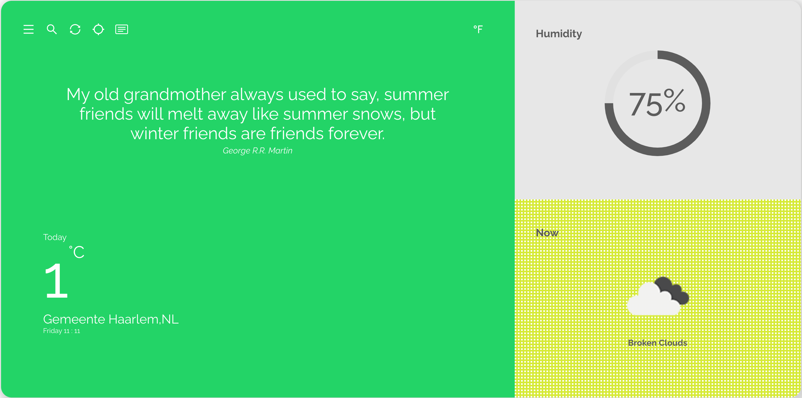

<h1 align="center">
 EfeLay Weather App
</h1>

# Efelay Weather App

Efelay Weather App is an application created with ReactJS where you can get the weather information on your location or any other choosen location.

## Table of contents:

- **[App demo](#app-demo)**
- **[Goals for this project](#goals-for-this-project)**
- **[Technologies used](#technologies-used)**
- **[User stories](#user-stories)**
- **[Instalation](#instalation)**
- **[Screenshots](#screenshots)**

### App Demo:

#### Link to the app [Efelay Weather App](https://efelay-weather.netlify.app/).

### Goals for this project

The goal of this project is to build a React app using different Api data.

### Technologies used:

### User Stories

- As a user, I want to see the current weather on my location
- As a user, I want to see the weather on any choosen location
- As a user, I want to see the forecast weather on my location
- As a user, I want to see the forecast weather on any choosen location
- As a user, I want to see the current weather in Fahrenheit
- As a user, I want to see the forecast weather in Fahrenheit

### Instalation

1. Clone the app
2. cd into your project
3. install dependencies (npm install)
4. Start development server with (npm start)

### Screenshots

